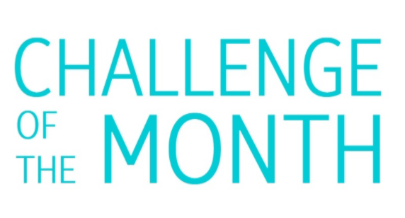

# Classroom Mask Detecor

**Problem**: Your school has begun with many strict measures to ensure safety of all the students. Safe distance is to be maintained, everyone should wear a mask, etc. but while everyone is expected to take measures to stay safe, it is noticed that many students take off their masks in the classroom, usually in the absence of any teacher.

**Challenge**: You are called by your school authorities to use your AI skills to build a model to detect names of students who are not wearing their masks properly in the classrooms, with other features that you feel are important to maintain safety in the classroom environment.