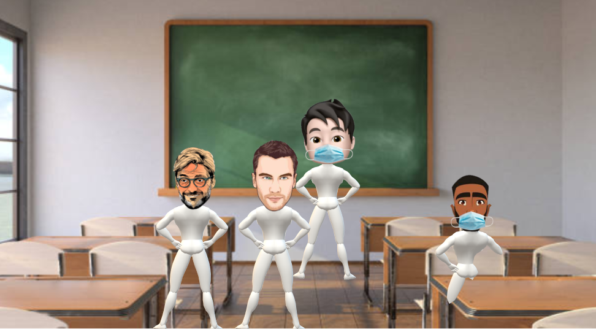
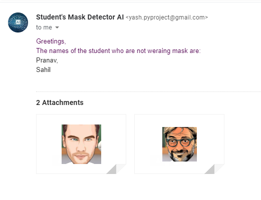

# Classroom Mask Detecor
## Demo
The input image was (The face images were taken from the result of the search query `animated faces` on google

After running this image through the application the sent mail was

>The mail consists of the names of the students who are not wearing a mask and their image (images are named as `f'{name_of_student}.png'`)

>If AI fails to identify few student's names it will send another mail consisting the faces of these students

## Data Set
In This project, the data set used is from [Kaggle](https://www.kaggle.com) 

### [Face Mask ~12K Images Dataset by Ashish Jangra](https://www.kaggle.com/ashishjangra27/face-mask-12k-images-dataset)

# This Project is the solution for

by [AI Student Community](https://aistudent.community/)

**Problem**: Your school has begun with many strict measures to ensure safety of all the students. Safe distance is to be maintained, everyone should wear a mask, etc. but while everyone is expected to take measures to stay safe, it is noticed that many students take off their masks in the classroom, usually in the absence of any teacher.

**Challenge**: You are called by your school authorities to use your AI skills to build a model to detect names of students who are not wearing their masks properly in the classrooms, with other features that you feel are important to maintain safety in the classroom environment.

## [04_Complete_Project_onefile.ipynb](./04_Complete_Project_onefile.ipynb)
This file consists the complete project without face detection 
## [3.1_Student_Mask_Detector.ipynb](./3.1_Student_Mask_Detector)
This Notebook is the main mask detector application which can also perform `face recognition` 
>This file is made using the following files
1. [01_Data_Cleaning.ipynb](./01_Data_Cleaning.ipynb) # To clean the data used for modeling
1. [02_Modeling.ipynb](./02_Modeling.ipynb) # To make the classification DNN model
1. [2.1_Model_Testing.ipynb](./2.1_Model_Testing.ipynb) # Testing the DNN model
1. [classroom_mask_detector_essestials.py](./classroom_mask_detector_essestials.py) # Custom module which has all the constants and classes to perform the essential tasks for the Project
## Dependencies
- numpy  `# Basic need`
- opencv-python  `# Basic need`
- cmake  `# For face-recognition`
- dlib  `# For face-recognition`
- face_recognition  `# For face-recognition`
- Matplotlib  `# Not important but helpful in development`
- Keras  `# To make the model`
- Tensorflow  `# Dependency of Keras`
